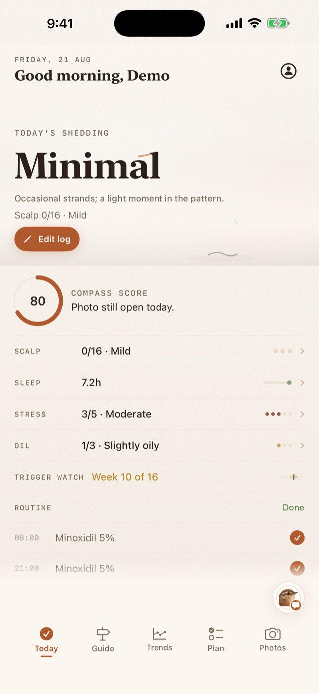

# Hair Compass AI

**An honest record of slow change.** Hair Compass AI is an iPhone app for keeping shedding,
scalp comfort, routines, treatments, labs and repeatable progress photos in one calm longitudinal
record.

[Download on the App Store](https://apps.apple.com/app/id6803796144) ·
[Website](https://haircompass-ai.com/) ·
[Privacy policy](https://haircompass-ai.com/privacy-policy.html) ·
[Support](https://haircompass-ai.com/support.html)



## What it tracks

- Daily hair and scalp check-ins
- Care plans, medications and supplements
- Treatment and procedure history
- Repeatable progress-photo journeys
- Lab results and lifestyle context
- Long-horizon trends and clinician-friendly summaries
- Optional Wren AI guidance with explicit consent and Beta notices

Hair Compass AI is for personal tracking and education. It does not diagnose, recommend personal
medication changes or promise regrowth. The primary record and progress photos stay on the
iPhone. Optional cloud Wren processing is separately disclosed in the privacy policy.

## Development

The app is built with SwiftUI and SwiftData for iPhone and requires iOS 26.2 or later. Open
`Hair Compass AI.xcodeproj` and build the shared `Hair Compass AI` scheme. Environment keys used
for development are not included in the repository.

```bash
xcodebuild build \
  -project "Hair Compass AI.xcodeproj" \
  -scheme "Hair Compass AI" \
  -destination 'platform=iOS Simulator,name=iPhone 16 Pro'
```

See [`MOOSAWI_HANDOVER.md`](MOOSAWI_HANDOVER.md) before changing app/server integration behavior.
